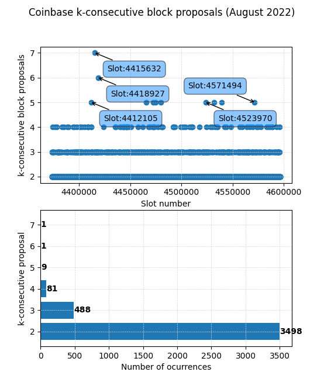

This article answers the following question: How likely is it that a given Ethereum staking pool controlling `p` of the stake proposes `k` consecutive blocks within an epoch.

After *The Merge* (transition from Proof of Work to Proof of Stake ), this is of paramount importance since it opens up a new dimension for *Maximal Extractable Value*[^1].
[^1]: <https://ethereum.org/en/developers/docs/mev/>

To begin with, these probabilities are analytically modeled and then validated through Montecarlo simulations. To conclude, on-chain data is used to study n-consecutive block proposals for Coinbase, a well-known entity in the Ethereum consensus layer.

1 Introduction
---

Ethereum is a byzantine fault tolerant[^2] public distributed database (a.k.a. blockchain) that is made out of thousands of nodes storing its information, making it one of the most resilient systems invented so far. Technically, it can store arbitrary information but the main use case in the last few years has been related to finance, where the blockchain is used as a ledger, storing account balances.
[^2]: <https://en.wikipedia.org/wiki/Byzantine_fault>

Miners (or validators, as they will be called after September 2022 once Ethereum migrates from Proof of Work to Proof of Stake) are responsible for updating the database, taking turns at a constant peace of 12 seconds, creating new blocks aggregating multiple valid transactions and appending them to the blockchain. They collect a fee in return, which incentivizes them to behave properly and include as many transactions as possible.

Needless to say, miners/validators have not only a great responsibility in the network, but a lot of power as well, since ultimately they are the ones modifying the distributed ledger. This ability to modify it can be (and is) leveraged by them to extract monetary value, the so-called MEV.

However, the soon-to-happen transition from Proof of Work to Proof of Stake, will introduce new ways of extracting MEV, like multi-block MEV, where a given entity controlling `p` share of the network stake will propose `k` consecutive blocks with a given probability. This article models these probabilities both analytically and empirically.

2 Ethash vs RANDAO
---

Before diving into the modeling, you may ask. Why isn't multiblock MEV possible in PoW but is in PoS? Well, it's because of the algorithm that selects who proposes the next block. Let's see the differences:

* In **PoW**, block proposers are selected with *ethash*, where the first to solve a complex puzzle is given the right to propose the next block. It takes around 13 seconds to find this solution, but the key here is that the next proposer is not deterministic. It's just based on i) hashpower and ii) luck. No one knows the next proposer until the solution is found.
* Whereas in **PoS**, block proposers are selected using *RANDAO*, some kind of RNG (*Random Number Generator*) algorithm, that gets entropy from all the participants among other sources[^3]. Its main difference from other is that randao is deterministic within each epoch, since all validators have to reach the same conclusion on who is the next proposer.
[^3]: <https://eth2book.info/altair/part2/building_blocks/randomness#where-does-the-entropy-come-from>

The key here is that *RANDAO* is updated just once per epoch (32 slots of 12 seconds) so in PoS anyone can know who is going to propose the next 32 blocks. Knowing this allows for multi-block MEV, something that is not possible in PoW.

3 Intro to MEV
---

MEV stands for *Maximal Extractable Value*. It refers to the value that can be extracted by **including**, **excluding**, or **changing** the order of the transactions within a block. Since the miners/validators are the ones creating the blocks and appending them to the ledger, they have this power. Note that changing the order or excluding transactions in the block they propose is not against the protocol rules, so MEV can be extracted without acting maliciously (ethics aside).
Some ways of MEV:

* **frontrunning**: Let's say that you have detected an arbitrage opportunity between two DEX, and try to benefit from that. You create a transaction and send it to the mempool. Well, the miner/validator creating the next block will see your transaction, and will most likely include their transaction first, so that when you arrive, the arbitrage opportunity no longer exists because someone else has already benefited from it.
* **sandwiching**: Are you buying a high amount of Eth? Well, that will push the price up a bit. If someone sees this transaction in the *mempool*, it will place a transaction before you buy Eth, then yours and then one selling.

4 Etheruem Pools and Validators
---

At the time of writing, Ethereum's consensus layer is made out of more than 415.000[^4] validators. In each slot (every 12 seconds) a validator is randomly chosen to propose the block in that slot. An epoch contains 32 slots, so a given validator "rolls the dice" 32 times per epoch to propose a block.
[^4]: <https://www.beaconcha.in>

With that high number of validators, you may think that it won't be very likely that a validator proposes more than one block per epoch, and even less likely that it proposes multiple blocks in a row, which is what we are studying in this post.

However, not all validators belong to completely uncorrelated entities. Some pools or operators control several hundred or even thousands of validators, so we must calculate the probabilities on a pool/operator level, not on a validator level. A pool controlling 10% of the stake, or 40k+ validators, the probability that it proposes 2 or even 3 blocks in a row is not neglectable. This is exactly what we are quantifying.

5 Analytical Analysis
---

Hereunder we model analytically the probability of a pool proposing `k` blocks in a row within an epoch controlling `p` of the total validators.

In each slot, each validator has the same probability of proposing the block. This can be modeled as a binomial distribution[^5], where the probability of success `p` is:
[^5]: <https://en.wikipedia.org/wiki/Binomial_distribution>

$$
p = \frac{1}{n-active-validators}
$$


However, as we have explained, some entities control several thousands of validators. Let `v` be the number of validators that a given pool controls, we can calculate the probability of a given pool proposing a block in a slot as:

$$
p = \frac{1}{n-active-validators} * v
$$

But we are interested in the probability of the pool proposing `k` **consecutive** blocks in a **whole epoch**, which is not trivial.

If we didn't care that the blocks were consecutive, we could use the following expression to calculate the probability of getting exactly `k` successes in `n` independent trials with `p` probability of success. But it's **not** what we want.

$$
\binom{n}{k}  p^k(1-p)^{n-k}
$$

Leaving Ethereum particularities aside, we can model this problem as the chances of getting `k` consecutive heads when flipping a biased coin `n=32` times with a probability of a head of `p`.

For the sake of simplicity, let's imagine that we want to study the probability of having `k=2` (two consecutive heads `HH`) in `n=3` (three trials). In this case, there are only $ 2^3 = 8 $ different outcomes, where 3 contains our `HH` sequence (success) and 5 doesn't.

```
HHH -> p^3        ->sucess
HHT -> p^2*(1-p)  ->sucess
HTT -> p*(1-p)^2
HTH -> p^2*(1-p)
THH -> p*(1-p)^2  ->sucess
TTH -> p*(1-p)^2
THT -> p*(1-p)^2
TTT -> (1-p)^3
```

So we can calculate the probability of success by adding all individual outcomes that contain HH as $ p^3 + p^2 * (1-p) + p * (1-p)^2 $

Let $ p_i $ be the individual probability of the $i$-th event, and the sum of all individual probabilities is one:

$$
\sum_{n=0}^{2^k}p_i = 1
$$

This simplification with 3 realizations instead of 32 gave us an intuition of the problem but in our case, we have $ 2^{32} = 4,294,967,296 $ individual probabilities and adding all the success cases is not something we can do manually.

Luckily, this post[^6] noticed that the number of successes for having **at least** `k` consecutive heads in `n` trials for an unbiased coin `p=0.5` can be calculated as:
[^6]: <https://leancrew.com/all-this/2009/06/stochasticity/>

$$
n_{successes} = 2^n-F_{n+2}^{(k)}
$$

Where $ F_{n+2}^{(k)} $ is the $ (n+2)^{th} $ [Fibonacci k-step number](http://mathworld.wolfram.com/Fibonaccin-StepNumber.html). So it can be generalized as:

$$
p_{nosuccess} = \frac{F_{n+2}^{(k)}}{2^n}
$$

$$
p_{success} = \frac{2^n-F_{n+2}^{(k)}}{2^n}
$$

For example, the probability[^7] of getting at least 7 runs with heads using an unbiased coin in 100 coin flips, would be:
[^7]: <https://leancrew.com/all-this/2009/06/stochasticity/>

$$
\frac{2^{100} - F_{102}^{(7)}}{2^{100}} = 0.318
$$

However, we can't use this since:
* We can't model our problem as an unbiased coin, since our probability of success depends on the % of the validator the pool controls. In other words `p!=0.5`.
* It calculates the probability of having **at least** `k` consecutive proposals, but we are interested in the changes of **exactly** `k` proposals.

Luckily, Feller came up with an approximation[^8] that allows us to calculate the probability of no success:
[^8]: [An Introduction to Probability Theory and Its Applications, 3rd Edition, p. 325, equation 7.11](https://www.academia.edu/40196544/An_Introduction_To_Probability_Theory_And_Its_Applications_Vol_1_3rd_Edition_by_William_Feller_H)

$$
q_n \approx \frac{1-px}{(r+1-rx)q}  \frac{1}{x^{n+1}}
$$

Where:
* `r` consecutive events (`k` in our case, the consecutive blocks)
* `n` trial (`n=32` in our case)
* `p` probability of success (in our case the share of validators of the pool)
* `q=1-p`
* `x` is the closest real root to one calculated as follows.

$$
1 -x+qp^rx^{r+1} = 0
$$

We can write this expression in Python solving for `x` and then for `q_n`. With this, we get that the probability of a pool controlling 30% of all validators `p=0.3` proposing 2 consecutive blocks `k=2` in an epoch is 90.71 %.

```python
from sympy import *
x = symbols('x', real=True)

r = 2; n = 32; p = 0.3

xx = min(i for i in solve(1-x+(1-p)*p**r*x**(r+1)) if i > 1)
qn = ((1 - p*xx) / ((r + 1 - r*xx)*(1-p))) * (1/(xx**(n+1)))

print("Probability of no success:", qn*100, "%")  #  9.28 %
print("Probability of success:", (1-qn)*100, "%") # 90.71 %
```

6 Montecarlo Simulations
---

In order to validate that our analytical probabilities are correct, we run a Monte Carlo simulation. By repeated random sampling (simulating hundreds of thousands of epochs) we can calculate the probabilities of each event empirically, and then compare it against the analytical results.

With a simple Python script, we can estimate the probability of a pool controlling 30% of the stake `p=0.3` proposing at least 2 blocks in a row `r=2`, which is 90.865 %, a number quite close to the analytical one.

```python
from numpy import random
from itertools import groupby

def max_consecutive_ones(l):
    return max(([sum(g) for i, g in groupby(l) if i == 1]), default=0)

num_trials = 500000
r = 2; n = 32; p = 0.3

epoch_proposals = [random.binomial(1, p, size=n) for i in range(num_trials)]
num_of_n_consec_proposals = sum([1 for i in epoch_proposals if max_consecutive_ones(i) >= r])

print("Probability of success:", num_of_n_consec_proposals/num_trials * 100, "%")
# 90.865 %
```

7 Conclusions And Results
---

Using the scripts above, we calculate the probabilities of proposing `k` consecutive blocks for a pool controlling `p` of the validators (over one). Note that the probabilities are displayed in percentage, so a pool controlling 10% of the validators will have a chance of 0.2617% of proposing at least 4 blocks in a row.

Analytical probabilities in % (using Feller's estimation)

|        | k=2     | k=3     | k=4       | k=5       |
|--------|---------|---------|-----------|-----------|
| p=0.01 | 0.3066  | 0.0029  | 2.8719e-5 | 2.7729e-7 |
| p=0.05 | 7.1490  | 0.3563  | 0.0172    | 0.0008    |
| p=0.1  | 24.8938 | 2.6814  | 0.2617    | 0.0252    |
| p=0.2  | 66.2931 | 17.9493 | 3.6941    | 0.7215    |
| p=0.3  | 90.7154 | 45.9332 | 15.7139   | 4.7601    |
| p=0.4  | 98.4841 | 74.4787 | 38.6253   | 16.6232   |
| p=0.5  | 99.8672 | 92.2060 | 66.4729   | 38.9562   |

Montecarlo probabilities in % (with 100000 runs per tuple)

|        | k=2    | k=3    | k=4    | k=5    |
|--------|--------|--------|--------|--------|
| p=0.01 | 0.315  | 0.003  | 0.001  | 0.0    |
| p=0.05 | 7.063  | 0.335  | 0.030  | 0.0    |
| p=0.1  | 24.743 | 2.675  | 0.258  | 0.0139 |
| p=0.2  | 66.039 | 17.918 | 3.622  | 0.675  |
| p=0.3  | 90.468 | 45.763 | 15.540 | 4.808  |
| p=0.4  | 98.470 | 74.514 | 38.726 | 16.622 |
| p=0.5  | 99.868 | 92.240 | 66.548 | 38.872 |

As we can see, both the empirical and analytical results match, so we can validate that our simulations are correct. We can also see that for a pool controlling >10% of the total validators, the probability of proposing 2, 3 or even 4 blocks is not neglectable.


Note that one epoch has a duration of 12*32 seconds so there are:
* 225 epochs in a day:
* 6750 epoch in a month.

So we can calculate the number of `k` consecutive blocks per day/month that a pool controlling `p` share of the network will propose. We just need to multiply the probability by 225 for the former or 6750 for the latter.

So a pool/operator controlling 10% of the total validators `p=0.1` will propose 4 blocks in a row `k=4` with a chance of 0.258% (see table). If we extrapolate to day/month, these are the number of blocks on average that will be proposed.
* $ \frac{0.256}{100} * 225 = 0.58 $ `4`-consecutive blocks a day.
* $ \frac{0.256}{100} * 6759 = 17.4 $ `4`-consecutive blocks a month.


Once the theory behind is clear, we can apply it to reality. To do so, we just need to know `p` (% of validators that a given entity controls). However, it's not trivial to estimate this number.

All validators that the Ethereum network contains, are the result of depositing 32 Eth to the Ethereum deposit contract[^9], meaning that every single validator of the 420000+ has done this deposit, with a receipt we can find onchain.
[^9]: <https://etherscan.io/address/0x00000000219ab540356cbb839cbe05303d7705fa>

If we know who controls the `from` address that was used for the 32 Eth deposit, we know who controls the validator.

If an entity has done multiple deposits, we can label all validators they control, so we will know who may benefit from the multi-block MEV studied in this post.

The following table shows the `k` consecutive blocks that each pool/operator will propose per month. It can be generated with this code[^10] and the percentages are taken crossing data from [ethereumpools.info](ethereumpools.info), [rated.network](rated.network), [beaconcha.in](beaconcha.in) and [etherscan.io](etherscan.io).
[^10]: [nblock_probabilities.py](/files/post_n_block_stats/nblock_probabilities.py)


For example, assuming that Coinbase controls 14.68% of all validators, it's expected that they will propose 5 blocks in a row 11 times a month.

| k-consecutive blocks/month ➡️  pool share (sept-2022) ⬇️ | k=2  | k=3  | k=4  | k=5  | k=6  | k=7  |
|---------------------------------------------------------|------|------|------|------|------|------|
| 🥇 Coinbase (14.68 %)                                   | 3051 | 531  | 76   | 11   | 1.80 | 0.14 |
| 🥈 Kraken (8.76 %)                                      | 1339 | 125  | 10   | 1.2  | 0.04 | 0    |
| 🥉 Binance (5.16 %)                                     | 511  | 25   | 1.3  | 0.06 | 0    | 0    |
| BitcoinSuisse (2.15 %)                                  | 93   | 1.7  | 0.06 | 0    | 0    | 0    |
| Lido Blockscape (1.76 %)                                | 63   | 1.5  | 0    | 0    | 0    | 0    |
| Stakedus (1.26 %)                                       | 33   | 0.67 | 0    | 0    | 0    | 0    |
| F2Pool (0.84 %)                                         | 14   | 0.27 | 0    | 0    | 0    | 0    |
| Bitfinex (0.77 %)                                       | 12   | 0.20 | 0    | 0    | 0    | 0    |
| Huobi (0.68 %)                                          | 8    | 0.00 | 0    | 0    | 0    | 0    |
| Bloxstaking (0.57 %)                                    | 7    | 0.00 | 0    | 0    | 0    | 0    |


**Disclaimer**: These percentages represent just an estimation crossing data from multiple sources and with on-chain analytics. Some operators like Lido Blockscape publicly recognize their validators, but it's not always the case. Some % may be wrong.


8 Case Study
---

Along the post, we have calculated the probabilities of proposing `k` blocks in a row for a pool/operator controlling `p` of all validators. But, can we empirically verify in the beacon chain that our numbers match?

Hereunder we analyze Coinbase block proposals during August 2022, using data directly taken from the beacon chain, and count the number of `k` consecutive block proposals `k=2...7` that took place.

Note that this analysis is done *ex post*, meaning that we have taken the blocks that Coinbase proposed, not the ones they should have proposed (aka duties).

For traceability, we used this query[^11] in Dune[^12] to get the validators[^13] that **we estimate** Coinbase controls. The query scans all deposits looking for a recurrent pattern that is believed to identify Coinbase validators. 32ish Eth are moved to new address, then the deposit is performed and the leftovers are sent back to a Coinbase Misc[^14].
[^11]: [coinbase_validators_query.sql](/files/post_n_block_stats/coinbase_validators_query.sql)
[^12]: <https://dune.com>
[^13]: [coinbase_validators_sept2022.csv](/files/post_n_block_stats/coinbase_validators_sept2022.csv)
[^14]: <https://etherscan.io/address/0xa090e606e30bd747d4e6245a1517ebe430f0057e>


In September 2022, we detected a total of 62351 deposited validators with this method.

Filtering all blocks proposed by these 62351 valiators, we get that the following blocks[^15] were proposed by Coinbase.
[^15]: [coinbase_blocks_sept2022.csv](/files/post_n_block_stats/coinbase_blocks_sept2022.csv)

Here we can see the k-consecutive proposals for Coinbase during August 2022. In the first figure, we can see the frequency of `k`-consecutive proposals over time (not that slots map 1:1 to a given timestamp). In the second figure we can see the count of each `k`-consecutive proposal.




As we can see, over this month Coinbase proposed 7 blocks in a row starting in slot `4415632` and ending in `4415638`, both belonging to epoch `137988`, that started Aug-06-2022 06:43:35 PM UTC.

All slots [4415632](https://beaconcha.in/slot/4415632), [4415633](https://beaconcha.in/slot/4415633), [4415634](https://beaconcha.in/slot/4415634), [4415635](https://beaconcha.in/slot/4415635), [4415636](https://beaconcha.in/slot/4415636), [4415637](https://beaconcha.in/slot/4415637), [4415638](https://beaconcha.in/slot/4415638), were proposed respectively by validators [186206](https://beaconcha.in/validator/186206), [392916](https://beaconcha.in/validator/392916), [276875](https://beaconcha.in/validator/276875), [234842](https://beaconcha.in/validator/234842), [227147](https://beaconcha.in/validator/227147), [302780](https://beaconcha.in/validator/302780), [134031](https://beaconcha.in/validator/134031), which with the above-explained methodology, can be labeled as part of Coinbase.

Now that we have the empirical data, we can compare it with the Montecarlo simulations and analytical results from the previous section. We can observe some minor differences, that may be due to a lack of enough realizations, and should converge to the theoretical results when we increase the timespan, i.e. 6 or 12 months.

| 🥇 Coinbase (14.68 %)   | k=2 | k=3 | k=4 | k=5 | k=6 | k=7 |
| --- | --- | --- | --- | --- | --- | --- |
| Theoretical monthly proposals | 3051 | 531 | 76 | 11 | 1.80 | 0.14 |
| Empirical monthly proposals | 3498 | 488 | 81 | 9 | 1 | 1 |
